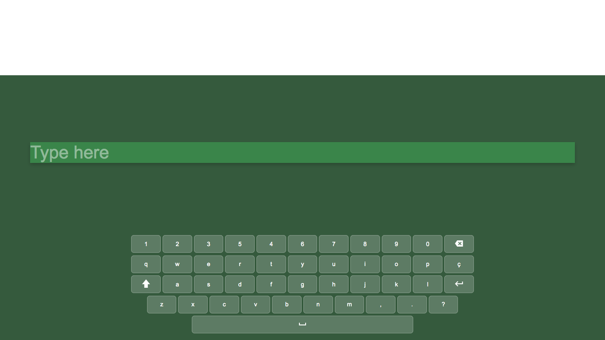

# Virtual Keyboard Project

This virtual keyboard project is being developed using HTML, CSS, and JavaScript. It is designed to be responsive and functional on various devices. Currently, the functions of the buttons, space, and backspace are implemented. In the future, I plan to add features such as accentuation, shift, and caps lock.

## Table of Contents

- [Virtual Keyboard Project](#virtual-keyboard-project)
  - [Functionalities](#functionalities)
  - [Technologies Used](#technologies-used)
  - [Installation and Usage](#installation-and-usage)
  - [Learning and Observations](#learning-and-observations)
  - [Social Media](#social-media)
  - [Credits](#credits)

## Functionalities

- Typing text using buttons on the virtual keyboard.
- Spacebar for inserting spaces between words.
- Backspace for deleting typed characters.

## Technologies Used

- HTML
- CSS
- JavaScript

## Installation and Usage

1. Clone this repository or download the files.
2. Open the `index.html` file in a web browser.

## Learning and Observations

During this project, I learned how to create a responsive virtual keyboard and manipulate the DOM with JavaScript to handle typing and other keyboard functions.

## Social Media

Connect with me on social media:
- LinkedIn: [Lucas Lacerda](https://www.linkedin.com/in/lucas-lacerda-066316186/)
- GitHub: [Lucasdelacerda](https://github.com/Lucasdelacerda)

## Credits

- Author: Lucas de Lacerda
