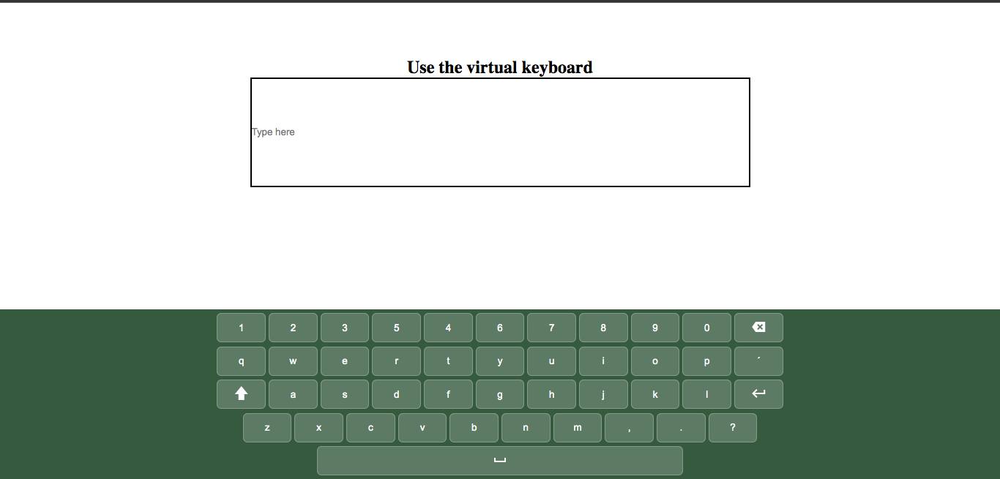

# Projeto de Teclado Virtual

Este projeto de teclado virtual está sendo desenvolvido com as tecnologias HTML, CSS e JavaScript ele foi projetado para ser responsivo e funcional em diversos dispositivos. Até o momento, as funções dos botões, do espaço e do backspace estão implementadas. Futuramente, planejo adicionar as funções de acentuação, shift e caps lock.

## Sumário

- [Projeto de Teclado Virtual](#projeto-de-teclado-virtual)
  - [Funcionalidades](#funcionalidades)
  - [Tecnologias Utilizadas](#tecnologias-utilizadas)
  - [Instalação e Uso](#instalação-e-uso)
  - [Aprendizado e Observações](#aprendizado-e-observações)
  - [Próximas Etapas](#próximas-etapas)
  - [Redes sociais](#redes-sociais)
  - [Créditos](#créditos)

## Funcionalidades

- Digitação de texto usando botões no teclado virtual.
- Espaço para inserção de espaço entre palavras.
- Backspace para exclusão de caracteres digitados.

## Tecnologias Utilizadas

- HTML
- CSS
- JavaScript

## Instalação e Uso

1. Clone este repositório ou baixe os arquivos.
2. Abra o arquivo `index.html` em um navegador da web.

## Aprendizado e Observações

Durante este projeto, aprendi a criar um teclado virtual responsivo e a manipular o DOM com JavaScript para lidar com a digitação e outras funções do teclado.

## Próximas Etapas

As próximas etapas para este projeto incluem:
- Adicionar acentuação.
- Implementar funcionalidades de shift e caps lock.
- Aprimorar a interface de usuário.

## Redes Sociais

Conecte-se comigo nas redes sociais:
- LinkedIn: [Lucas Lacerda](https://www.linkedin.com/in/lucas-lacerda-066316186/)
- GitHub: [Lucasdelacerda](https://github.com/Lucasdelacerda)

## Créditos

- Autor: Lucas de Lacerda
